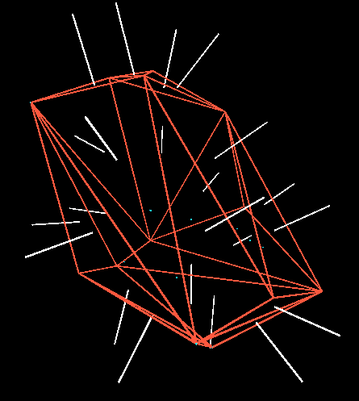
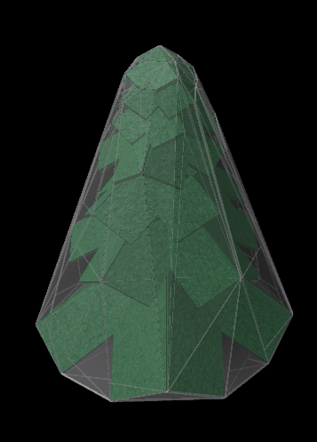
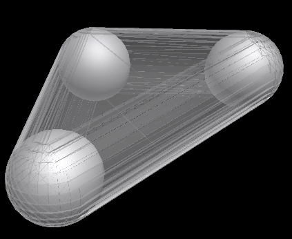
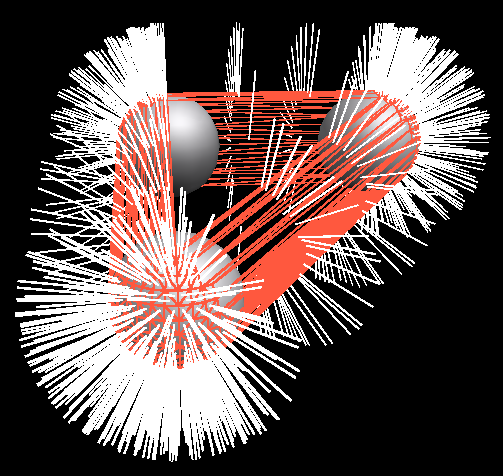

# Quickhull-lua
Based off of [Mauricio Poppe's quickhull3D](https://github.com/mauriciopoppe/quickhull3d) implementation.

Documentation is in the quickHull.lua file.

Here are a few pictures of it in action:

